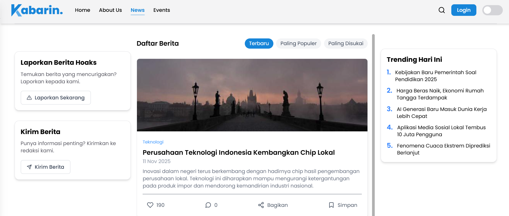

# Kabarin | Portal Berita Modern

Kabarin adalah portal berita modern yang dibangun menggunakan React dan Tailwind CSS. Aplikasi ini menghadirkan mode gelap/terang, infinite scroll, serta desain responsif untuk pengalaman pengguna yang nyaman di berbagai perangkat.

---

## 🚀 Tech Stack

- **React**: 19.1.1  
- **React DOM**: 19.1.1  
- **React Router DOM**: 7.9.5  
- **Tailwind CSS**: 4.1.16  
- **React Icons**: 5.5.0  

---

## ✨ Features

- 🌙 Dark Mode / Light Mode  
- 🔄 Infinite Scroll  
- 📱 Responsive Layout  

---

## 🔧 Installation

```bash
# Clone repository
git clone https://github.com/username/kabarin.git

#### Masuk ke folder proyek
$ cd kabarin

#### Install dependencies
$ npm install
#### atau
$ yarn install

# Menjalankan development server
npm run dev
# atau
yarn dev
```

## 📚 Documentation

### 🌐 Website Preview

Coba aplikasi secara langsung melalui link berikut:

**https://kabarin.vercel.app/**

### 📸 Screenshots

#### 🏠 Home Page  


#### 📰 News Detail Page  


---


